---
export_on_save:
  html: true
---
# BÁO CÁO PHÂN TÍCH CHIẾN LƯỢC TOÀN DIỆN - DATATHON 2026
**Đội thi:** The Gridbreakers  
**Chủ đề:** Tối Ưu Hóa Đa Biến - Nhu Cầu Khách Hàng × Chuỗi Cung Ứng × Trí Tuệ Nhân Tạo  
**Phiên bản:** Grand Master Report v4

---

## MỤC LỤC

| STT | Nội dung | Trang |
|:---:|---------|:-----:|
| 0 | Tóm Tắt Thực Thi | 1 |
| A | Bức Tranh Doanh Thu & Động Lực Thị Trường | 2 |
| B | Mô Hình Dự Báo & Giải Thích AI | 6 |
| C | Chiến Lược Chuỗi Cung Ứng & Nghịch Lý Thị Trường | 8 |
| D | Phân Tích Khách Hàng Chuyên Sâu | 10 |
| E | Khuyến Nghị Thực Thi Cho Ban Giám Đốc | 12 |
| PL | Phụ Lục Kỹ Thuật & Trực Quan Hóa Nâng Cao | 14 |

---

## DANH MỤC THUẬT NGỮ

| Thuật ngữ | Giải thích |
|-----------|-----------|
| **AOV** | Giá trị trung bình mỗi đơn hàng - thước đo sức chi trả của khách hàng |
| **Gross Margin** | Phần trăm doanh thu giữ lại sau khi trừ Giá vốn và chiết khấu |
| **Bounce Rate** | Phần trăm khách rời website ngay sau trang đầu tiên, không tương tác thêm |
| **CLV** | Tổng giá trị kinh tế mà một khách hàng mang lại trong suốt vòng đời |
| **Cherry-picking** | Hành vi chỉ mua sản phẩm giá rẻ để lạm dụng mã giảm giá, triệt tiêu lợi nhuận |
| **BNPL** | Mua trước trả sau / Trả góp - kích cầu cho phân khúc hàng giá cao |
| **SHAP** | Thuật toán AI giải thích được, lượng hóa mức tác động của từng biến số |
| **Isolated Nodes** | Sản phẩm không bao giờ được mua kèm cùng sản phẩm khác trong giỏ hàng |
| **Overstock Rate** | Tỷ lệ tồn kho dư thừa so với nhu cầu thực tế - càng cao càng rủi ro |
| **Sell-through Rate** | Tỷ lệ hàng bán được so với hàng nhập - thước đo hiệu quả quay vòng vốn |

---

## TÓM TẮT THỰC THI

Báo cáo này đánh dấu sự chuyển dịch trọng tâm từ phân tích mô tả sang phân tích đề xuất. Thay vì chỉ diễn giải các dữ liệu lịch sử, chúng tôi tập trung kiến tạo các chiến lược hành động thực tiễn. Thông qua phương pháp tối ưu hóa đa biến, mô hình tích hợp sức mạnh của nền tảng Học máy (LightGBM kết hợp SHAP) cùng Phân tích Hành vi Người dùng, nhằm mục tiêu tái cấu trúc toàn diện chuỗi giá trị.

### - Bốn Điểm Nghẽn Chiến Lược

| # | Tên gọi | Mô tả ngắn | Mức độ |
|:-:|---------|------------|:------:|
| 1 | **The Profit Trap** | Biên lợi nhuận sụp đổ có chu kỳ: Tháng 8 (năm lẻ) lỗ tới -35%, Tháng 12 chỉ còn 1-2% | Nghiêm trọng |
| 2 | **The Promotion Paradox** | Mã giảm giá bào mòn AOV thay vì kích cầu: AOV giảm từ 27.500 → 21.900 khi có khuyến mãi | Nghiêm trọng |
| 3 | **The Demographic Shift** | Thị trường ngách tỉnh lẻ + tệp 25-44 tuổi đang vươn lên, nhưng Mobile Checkout bị nghẽn |  Cần hành động |
| 4 | **The Market-Fit Paradox** | Hàng Outdoor đọng vốn (Overstock 80%) dù Rating rất cao → lệch pha phân khúc |  Cần hành động |

> **Thông điệp cốt lõi:** Doanh nghiệp đang **tăng trưởng doanh thu** nhưng đồng thời **chảy máu lợi nhuận** từ 4 mặt trận: khuyến mãi sai lệch, tồn kho đọng vốn, ma sát thanh toán Mobile, và lệch pha sản phẩm - thị trường.

> **Tác động dự kiến:** Chiến lược 5 trụ cột được đề xuất trong báo cáo kỳ vọng sẽ **(1)** khôi phục Gross Margin từ mức thâm hụt -35% về vùng an toàn +20%, **(2)** phục hồi chỉ số AOV lên 27.500 VNĐ (+25%), **(3)** giải phóng dòng vốn lưu động bằng cách cắt giảm 50% tỷ lệ đọng kho Outdoor (80% → 40%), và **(4)** hạ tỷ lệ bỏ giỏ hàng Mobile xuống dưới 40% — toàn bộ trong khung thời gian 6 tháng (Q1-Q2/2023).

---

## PHẦN A: BỨC TRANH DOANH THU & ĐỘNG LỰC THỊ TRƯỜNG

> **Mọi phân tích trong báo cáo này đều hướng về một mục tiêu:** Bảo vệ biên lợi nhuận - Dữ liệu cho thấy mặc dù quy mô doanh thu đang duy trì sự ổn định, nhưng biên lợi nhuận cốt lõi lại đang chịu sự "bào mòn" nghiêm trọng từ các lỗ hổng trong khâu vận hành.

### A.1 Phân Tích Chu Kỳ Doanh Thu & Động Lực Tăng Trưởng

Phân tích chuỗi dữ liệu giao dịch trong 10 năm qua giúp vẽ nên một biểu đồ vòng đời doanh nghiệp trải qua 3 giai đoạn mang tính bước ngoặt, với sự dịch chuyển rõ rệt về động lực cốt lõi:

| Giai đoạn | Khung thời gian | Trạng thái Doanh thu | Động lực dẫn dắt |
|-----------|:---:|:---------:|---------------|
| **Bứt phá & Đạt đỉnh** | 2013 - 2016 | Đỉnh 2.1 tỷ VNĐ (2016) | Tăng trưởng dựa trên quy mô: Đạt ~82.000 đơn/năm. Danh mục Streetwear đóng vai trò lực kéo chủ lực với 1.69 tỷ VNĐ. |
| **Thoái trào & Sàng lọc** | 2019 - 2021 | Chạm đáy 1.0 tỷ VNĐ | Thu hẹp thị phần đại trà: Khối lượng đơn giảm sâu từ 70.000 xuống 34.000.  Tuy nhiên, chỉ số AOV tăng vọt từ 25.000 lên 30.000 VNĐ. |
| **Phục hồi Cấu trúc** | 2022 | Khôi phục 1.16 tỷ VNĐ | AOV thiết lập đỉnh lịch sử 32.400 VNĐ.  Streetwear tái khẳng định vị thế khi chiếm lĩnh 83.9% thị phần, kết hợp cùng Casual và GenZ tạo bệ phóng tăng trưởng mới. |

**Nhận định Quản trị:** Nhịp điều chỉnh giảm trong giai đoạn 2019-2021 không xuất phát từ một cuộc khủng hoảng toàn hệ thống. Bản chất của sự suy thoái này phản ánh rủi ro phụ thuộc vào phân khúc khách hàng VIP — tệp chỉ chiếm 9% quy mô nhưng duy trì mức AOV kỷ lục (51.000 VNĐ) — đi kèm với sự suy yếu trong năng lực thu hút và giữ chân người dùng mới.

  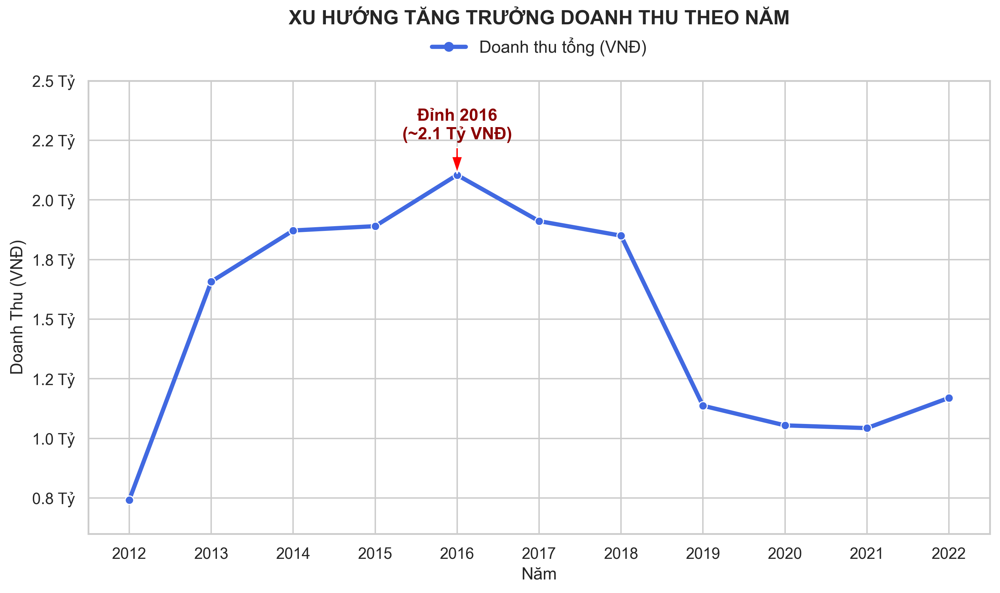
  
<em>Hình A.1: Xu hướng tăng trưởng doanh thu theo năm (2013-2022) - 3 giai đoạn rõ rệt</em>

### A.2 Tính Mùa Vụ & Hiệu Ứng Cộng Hưởng

Dữ liệu lịch sử xác nhận Quý 2 (Tháng 4-5-6) luôn là đỉnh điểm doanh thu. Động lực này xuất phát từ hiệu ứng cộng hưởng kép: sự kiện ra mắt bộ sưu tập Xuân/Hè kết hợp chiến lược đẩy số qua các chiến dịch "Spring Sale" và "Mid-Year Sale".

Bộ ba danh mục cốt lõi GenZ, Streetwear, Casual thể hiện sức bật mạnh mẽ nhất trong giai đoạn này:

| Danh mục | Tốc độ tăng trưởng Q2 | Định vị chiến lược |
|----------|:------------------------:|---------|
| **GenZ** | +90.6% | Đầu tàu tạo xu hướng, thu hút dòng khách hàng trẻ. |
| **Streetwear** | +72.4% | Nhóm sinh lời chủ lực, đảm bảo thanh khoản hệ thống. |
| **Casual** | +70.4% | Phân khúc nền tảng, duy trì biên lợi nhuận an toàn. |

  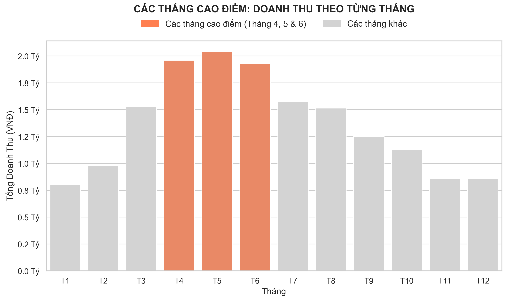
  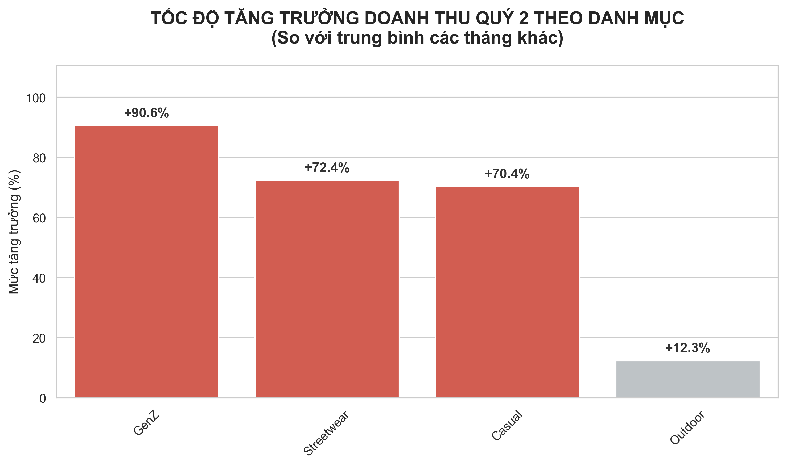
  
<em>Hình A.2: Đỉnh doanh thu Quý 2 (trái) và Bộ ba GenZ-Streetwear-Casual dẫn dắt tăng trưởng (phải)</em>

### A.3 Khủng Hoảng Suy Giảm Biên Lợi Nhuận Gộp

Bất chấp sự phục hồi về mặt doanh thu tổng, chỉ số Gross Margin đang phơi bày hai rạn nứt cấu trúc nghiêm trọng trong chiến lược định giá và khuyến mãi:

**Điểm gãy 1: Cái bẫy "Tháng 8 Năm Lẻ":**

| Khía cạnh | Tháng 8 năm chẵn | Tháng 8 năm lẻ |
|-----------|:-----------------:|:--------------:|
| Cấu trúc Khuyến mãi | Tỷ lệ phần trăm (Trung bình 10%) | Trợ giá cố định (Voucher 50.0 VNĐ) |
| Áp lực Chi phí | Trong ngưỡng an toàn | Bùng nổ gấp 10 lần |
| Gross Margin | +20% (Khỏe mạnh) | -35% (Thâm hụt nghiêm trọng) |

Khủng hoảng thâm hụt này không đến từ biến động thị trường, mà xuất phát 100% từ sai lầm trong thiết kế cấu trúc trợ giá.

  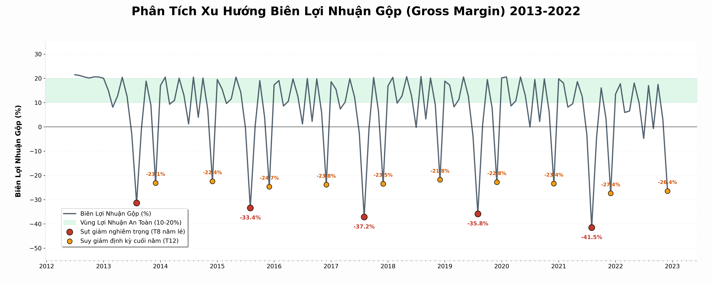
  
<em>Hình A.3a: Sự suy giảm biên lợi nhuận qua các năm - "Tháng 8 Năm Lẻ" lộ diện rõ</em>

**Điểm gãy 2: Hiệu ứng tự ăn thịt doanh thu tại "Sale chồng Sale" Tháng 12:** Dù Tháng 12 là chu kỳ mua sắm bùng nổ, biên lợi nhuận lại bị nén chặt xuống mức 1-2%. Việc lạm dụng tần suất khuyến mãi dày đặc cùng sự phình to của chi phí tiếp thị dịp cận Tết đang ăn mòn hoàn toàn phần giá trị thặng dư tạo ra.

  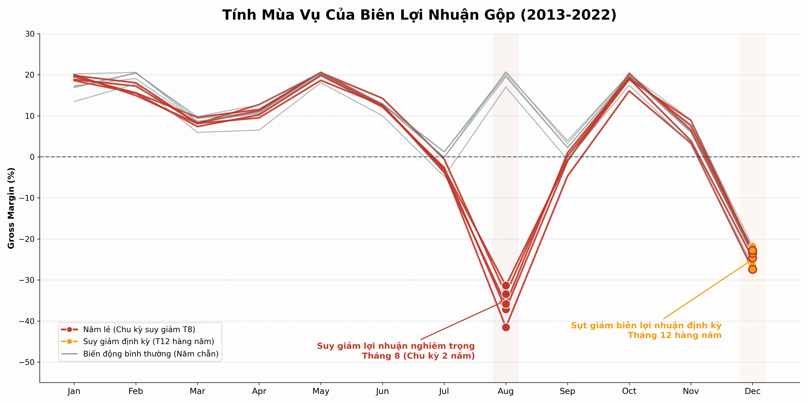
  
<em>Hình A.3b: Chu kỳ khủng hoảng biên lợi nhuận theo mùa - Tháng 8 & Tháng 12 là hai "hố đen"</em>

### A.4 Nhân Khẩu Học & Điểm Nghẽn Phễu Chuyển Đổi

#### Nguồn Truy Cập & Sự Trỗi Dậy Của Thị Trường Ngách

| Chỉ số trọng yếu | Giá trị | Hàm ý Kinh doanh |
|--------|:-------:|---------|
| Kênh dẫn dắt | **SEO** | Chiếm 28% lượng đơn hàng - tối ưu hóa cấu trúc chi phí tiếp thị. |
| Bounce Rate | **~47%** | Nằm trong vùng tối ưu, minh chứng luồng Trải nghiệm người dùng (UX) hiệu quả. |
| Phân khúc chủ lực | **25-44** | Đóng góp 56% khối lượng giao dịch, phản ánh tệp khách hàng có thu nhập ổn định. |
| Mở rộng địa lý | Cẩm Phả, Thái Nguyên, Biên Hòa | Sự chuyển dịch sức mua về các thị trường Cấp 2 và Cấp 3. |

  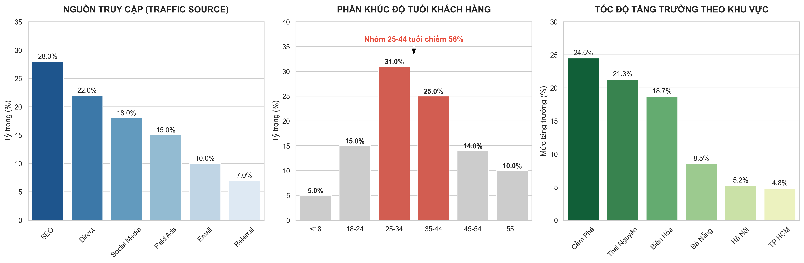
  
<em>Hình A.4a: Nhân khẩu học và Nguồn truy cập</em>

  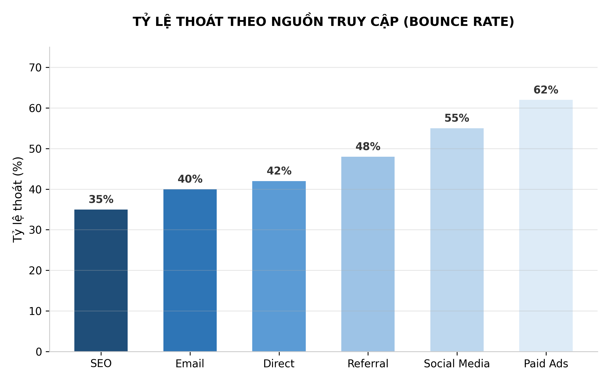
  
<em>Hình A.4b: Tỷ lệ thoát theo từng Kênh Truy Cập</em>

#### Nghịch lý Mobile - Điểm nghẽn tại Phễu thanh toán

Kênh Mobile đang dẫn đầu phễu thu hút khách hàng với 45.1% lưu lượng truy cập. Tuy nhiên, tỷ lệ từ bỏ giỏ hàng tại nền tảng này lại chạm ngưỡng báo động 68.5%. Kết hợp với thời lượng lưu trang trung bình lên tới 160 giây, dữ liệu minh chứng khách hàng có ý định mua sắm rất rõ ràng. Sự đứt gãy này chỉ ra điểm nghẽn nghiêm trọng về mặt UX tại bước thanh toán. Lực cản công nghệ đang làm gián đoạn hành trình mua, đòi hỏi Ban điều hành lập tức tối ưu hóa luồng thanh toán trên nền tảng di động.

  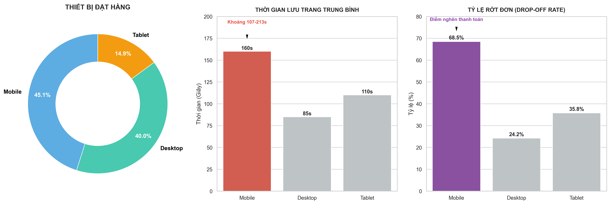
  
<em>Hình A.4c: Nghịch lý Mobile - Lưu lượng cao nhất nhưng tỷ lệ rớt đơn cũng cao nhất do những trở ngại khi thanh toán</em>

#### Cơ Cấu Thanh Toán & Đòn Bẩy Trả Góp

Hành vi thanh toán thể hiện mức độ số hóa cao khi Thẻ tín dụng chiếm áp đảo (55.1%), theo sau là hệ sinh thái ví điện tử như PayPal (15%) và Apple Pay (10%).

  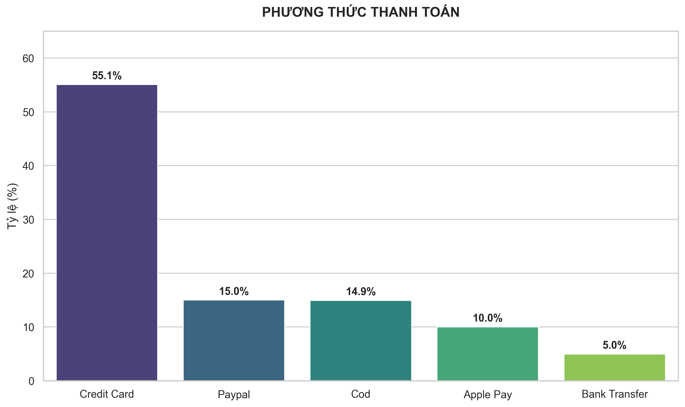
  
<em>Hình A.4d: Tỷ trọng Phương thức thanh toán</em>

**Định hình Chiến lược: Mua trước trả sau như một Động lực Bán hàng:**

Dữ liệu xác nhận sự phụ thuộc mạnh mẽ vào đòn bẩy tài chính khi chỉ có 40.6% giao dịch được tất toán một lần. Gần 60% dòng tiền đang chảy qua các giải pháp Mua trước trả sau, với kỳ hạn 3 tháng (33.8%) và 6-12 tháng (25.4%) chiếm ưu thế. Việc tích hợp Mua trước trả sau đã vượt ra khỏi vai trò một cổng thanh toán đơn thuần, trở thành chiến lược giảm rào cản tâm lý về giá, giúp doanh nghiệp chốt đơn hiệu quả mà không cần lạm dụng chiết khấu sâu để bảo vệ lợi nhuận.

  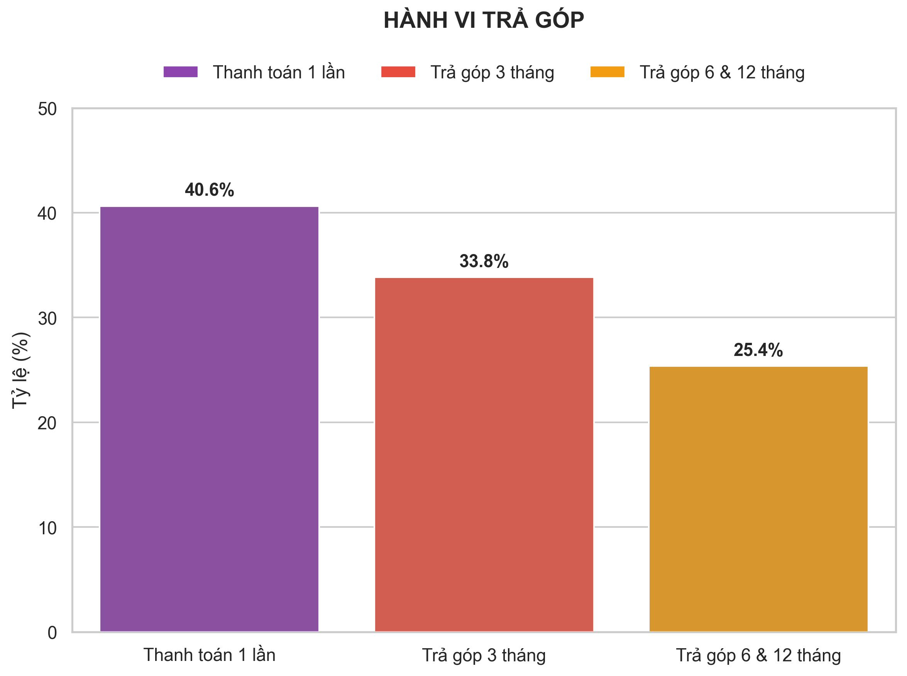
  
<em>Hình A.4e: Hành vi Trả góp - 60% khách hàng phụ thuộc vào Mua trước trả sau</em>

### A.5 Nghịch Lý Khuyến Mãi & Sự Bào Mòn Giá Trị

**Trợ giá sai mục tiêu gây suy giảm giá trị giỏ hàng**

Việc triển khai các chiến dịch khuyến mãi đang tạo ra phản ứng ngược. Mặc dù chiếm tới 38.4% tổng khối lượng đơn, nhóm giao dịch áp dụng mã giảm giá không những không gia tăng quy mô mua sắm mà còn trực tiếp kéo tụt chỉ số AOV xuống 20.5% (giảm từ 27.565 VNĐ xuống còn 21.914 VNĐ).

| Phân loại Đơn hàng | Mức AOV | Tác động Tài chính |
|----------|:---:|:----------:|
| **Nguyên giá** | 27.565 VNĐ | Mốc cơ sở |
| **Áp dụng Khuyến mãi** | 21.914 VNĐ | -20.5% ↓ Suy giảm giá trị |

Hành vi Cherry-picking của khách hàng — cố tình xé lẻ đơn hàng hoặc chỉ chọn các sản phẩm rẻ nhất để trục lợi mã giảm giá — đang biến công cụ kích cầu thành tác nhân gây loãng giá trị cốt lõi.

  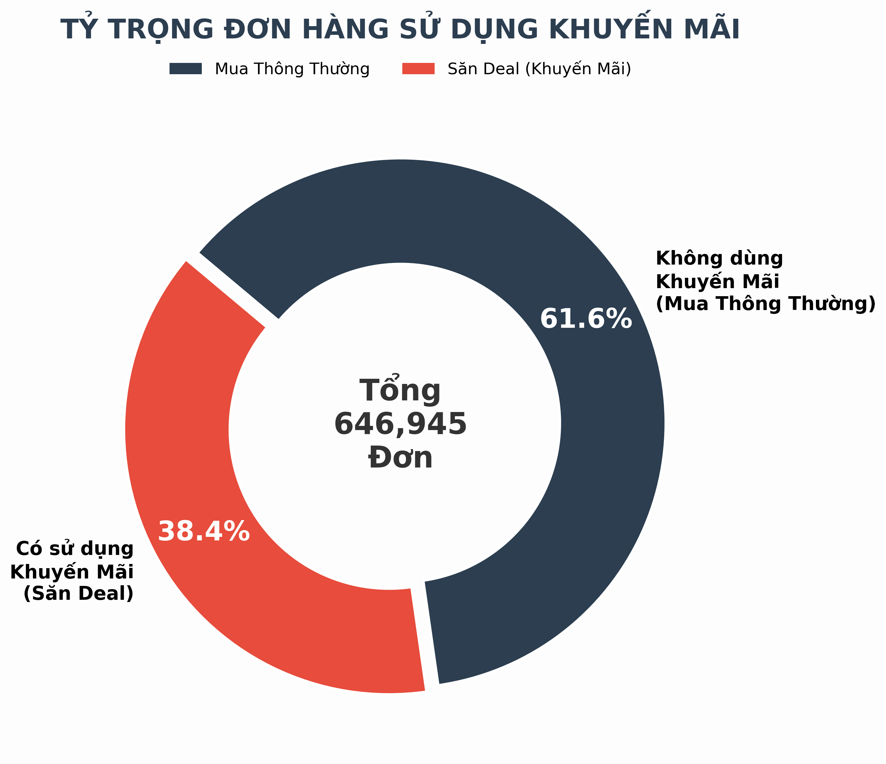
  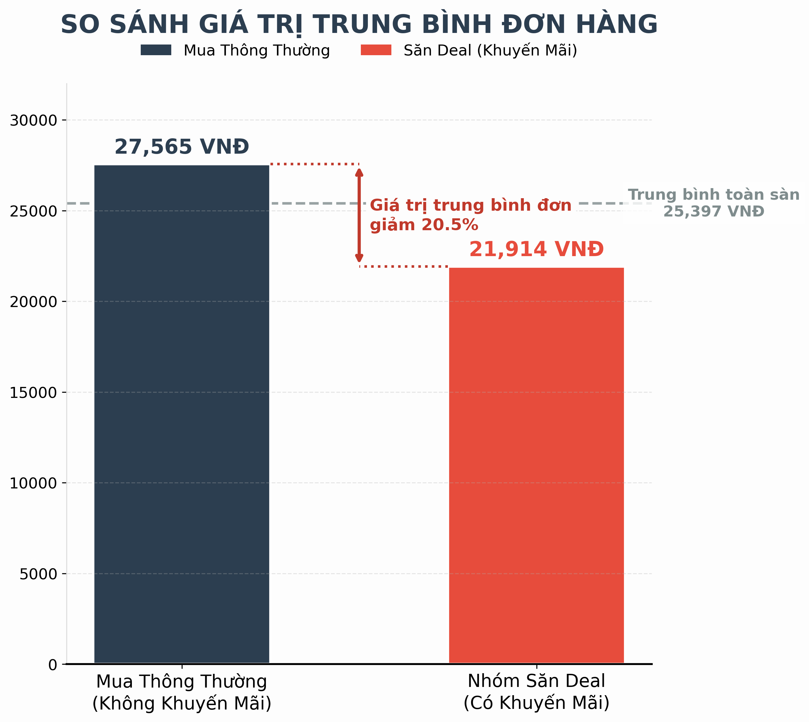
  
<em>Hình A.5a: AOV sụt giảm rõ rệt khi có khuyến mãi - minh chứng cho "Promotion Paradox"</em>

**Phân tích Đa biến: Tương quan Khuyến mãi & Biên lợi nhuận ròng:**

> **Công thức:** Biên Lợi Nhuận Ròng = (Lợi nhuận ròng / Tổng doanh thu)

| Chiến dịch | Biên Lợi Nhuận | Phân Loại Rủi Ro |
|:---|:---:|:---|
| **Urban Blowout** | -62.5% | Lỗ thảm họa |
| **Year-End Sale** | -19.6% | Thâm hụt tài chính nặng nề |
| **Mid-Year Sale** | -15.7% | Bào mòn ngân sách |
| **Rural Special** | -7.4% | Phá vỡ điểm hòa vốn |
| **Spring Sale** | -2.9% | Rủi ro xói mòn lợi nhuận |
| **Fall Launch** | +0.8% | Duy trì thặng dư tối thiểu |

**Hàm ý Quản trị:** Dữ liệu kiểm toán từ 6 chiến dịch trọng điểm bóc trần một thực trạng nguy hiểm: Doanh nghiệp đang mua tăng trưởng doanh thu bằng cái giá của lợi nhuận ròng. Ngoại trừ chiến dịch Fall Launch duy trì mức thặng dư mong manh (+0.8%), 5 chiến dịch còn lại đều tiêu hao ngân sách trầm trọng, đỉnh điểm là Urban Blowout với mức phá hủy giá trị lên tới -62.5%. Khuyến nghị Ban điều hành lập tức tái thiết kế cấu trúc khuyến mãi, chuyển từ chiến lược chiết khấu đại trà sang chiến lược bán chéo (Cross-selling / Bundling).

  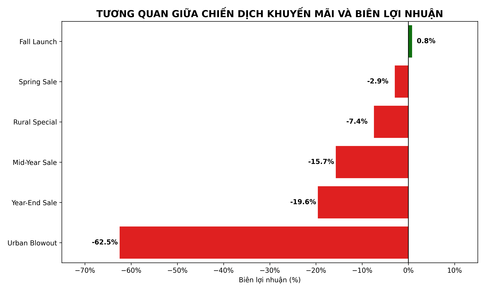
  
<em>Hình A.5b: Phân tích Promotion & Profit Margin - hầu hết chiến dịch đang "đốt tiền"</em>

### A.6 Cấu Trúc Phân Tầng Khách Hàng & Rủi Ro Tập Trung

| Phân Tầng | Tỷ Trọng | Đóng Góp AOV | Định Vị Chân Dung |
|:---|:---:|:---:|:---|
| **Khách Mới** | 51% | 18.000 VNĐ | Quy mô phủ sóng rộng nhưng tỷ lệ rớt phễu cao, mức độ sinh lời thấp. |
| **Khách Bạc** | 25% | 24.000 VNĐ | Giai đoạn chuyển tiếp, bắt đầu thiết lập thói quen tiêu dùng. |
| **Khách Vàng** | 15% | 32.000 VNĐ | Tệp khách hàng nòng cốt, tạo dòng tiền đều đặn. |
| **Khách Kim Cương** | 9% | 51.000 VNĐ | Trụ cột thanh khoản, sức chi trả gấp gần 3 lần tệp Khách Mới. |

**Cảnh Báo Rủi Ro Tập Trung:**
Cấu trúc phễu khách hàng hiện tại đang tiềm ẩn sự bất cân xứng nghiêm trọng. Mặc dù nhóm Khách Mới thống trị về mặt số lượng (51%), khả năng chuyển hóa thành doanh thu thực tế lại cực kỳ mờ nhạt. Toàn bộ trọng trách duy trì dòng tiền đang đè nặng lên vai tệp Khách Kim Cương — nhóm chỉ chiếm vỏn vẹn 9% nhưng có sức mua áp đảo. Trạng thái phân bổ này đẩy doanh nghiệp vào mức độ rủi ro tập trung cao độ; bất kỳ biến động nhỏ nào làm suy giảm tỷ lệ giữ chân của tệp 9% VIP này cũng sẽ gây chấn động lập tức đến cấu trúc lợi nhuận toàn hệ thống.

  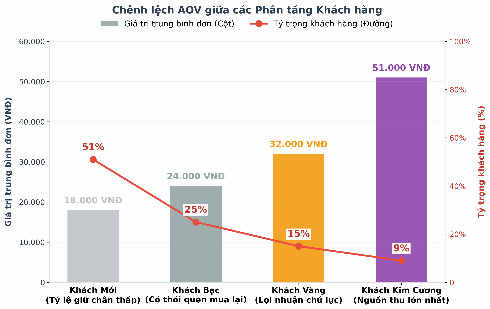
  
<em>Hình A.6: Chênh lệch AOV giữa các Phân tầng Khách hàng - VIP 9% chi phối toàn bộ dòng tiền</em>

---

## PHẦN B: HỆ THỐNG DỰ BÁO VÀ TRÍ TUỆ NHÂN TẠO CÓ THỂ DIỄN GIẢI

Để định lượng rủi ro tồn kho và nhận diện các nguyên nhân gốc rễ chi phối dòng tiền, hệ thống dự báo sử dụng thuật toán LightGBM kết hợp phương pháp SHAP đã được triển khai. Toàn bộ quy trình tuân thủ nghiêm ngặt nguyên tắc chống rò rỉ dữ liệu, đảm bảo tính ứng dụng cao khi đưa vào môi trường vận hành thực tế.

### B.1 Kiến Trúc Luồng Dữ Liệu

Quy trình dự báo được tự động hóa qua 5 giai đoạn cốt lõi:

1. **Trích xuất dữ liệu**: Nạp toàn bộ lịch sử giao dịch ở cấp độ hàng ngày trong giai đoạn 2012 - 2022, với quy mô 3.833 bản ghi.
2. **Tiền xử lý**: Chuẩn hóa định dạng chuỗi thời gian, xử lý các giá trị ngoại lai và đồng bộ hóa lịch Âm - Dương. Hệ thống áp dụng kỹ thuật giảm trọng số cho các ngày phong tỏa do đại dịch nhằm triệt tiêu nhiễu loạn từ các sự kiện bất khả kháng.
3. **Kỹ thuật trích xuất đặc trưng**: Xây dựng bộ 40 biến đầu vào (chi tiết tại mục B.2).
4. **Huấn luyện mô hình**: Xây dựng kiến trúc mô hình kép dự báo song song Doanh thu và Biên lợi nhuận gộp. Ứng dụng kỹ thuật Ensemble với 5 tập ngẫu nhiên để gia tăng tính ổn định. Mô hình được kiểm định qua tập Hold-out 18 tháng (07/2021 – 12/2022).
5. **Đầu ra kép**: Cung cấp kết quả dự báo cho năm 2023 - 2024 và xuất các giá trị SHAP để diễn giải mức độ tác động của từng biến số.

### B.2 Triết Lý Thiết Kế Đặc Trưng "Known-in-Advance"

Điểm sáng của hệ thống nằm ở việc thiết lập các biến số phân tích dựa trên nguyên tắc chỉ sử dụng thông tin "có thể biết trước" tại thời điểm dự báo. Biến số Khuyến mãi bị loại bỏ hoàn toàn khỏi bộ đặc trưng đầu vào do bản chất thuộc cấp độ giao dịch và không thể dự đoán chính xác trong dài hạn. Nguyên tắc này triệt tiêu tuyệt đối rủi ro thiên lệch tương lai. Bộ 40 biến được phân rã thành các nhóm cấu trúc:

- **Biến trễ đa tầng (8 biến)**: Bao gồm `revenue_lag_1` ($r=0.87$), `lag_7`, `lag_364`, `lag_365` ($r=0.79$)... nhằm khai thác quán tính dòng tiền trong cả chu kỳ ngắn hạn và dài hạn.
- **Lịch và Sóng chu kỳ (20 biến)**: Kết hợp các tham số thời gian cơ bản với phép biến đổi Fourier để biểu diễn tính mùa vụ dưới dạng sóng liên tục.
- **Sự kiện và Lễ hội (7 biến)**: Các biến định lượng khoảng cách thời gian đến Tết Nguyên Đán và các ngày lễ giúp mô hình nhận diện những cú sốc cầu có tính chu kỳ.
- **Hiệu ứng cuối tháng (2 biến)**: Biến `days_to_month_end` được thiết lập chuyên biệt để nắm bắt hiện tượng dồn đơn cuối kỳ.

### B.3 Diễn Giải Mô Hình Qua Phân Tích SHAP

Thay vì thỏa hiệp với một hệ thống thuật toán khép kín, công cụ SHAP được tích hợp để cho phép Ban điều hành thấu hiểu cơ sở luận lý của mọi kết quả dự báo. Dựa trên phân bổ tầm quan trọng của các đặc trưng từ phiên bản v6, hệ thống đúc kết 3 quy luật thị trường cốt lõi:

  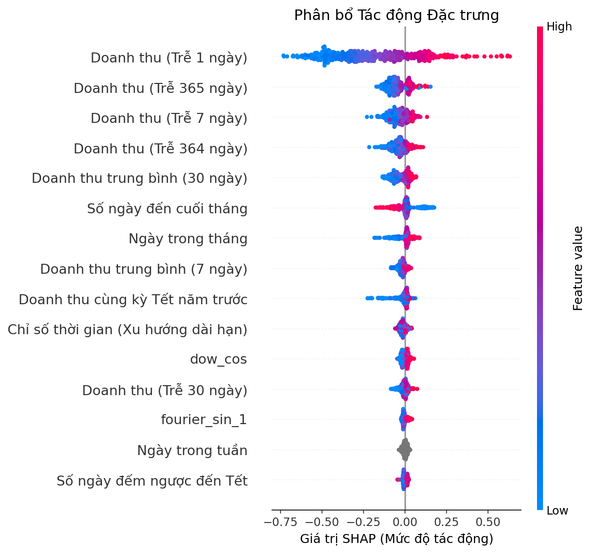
  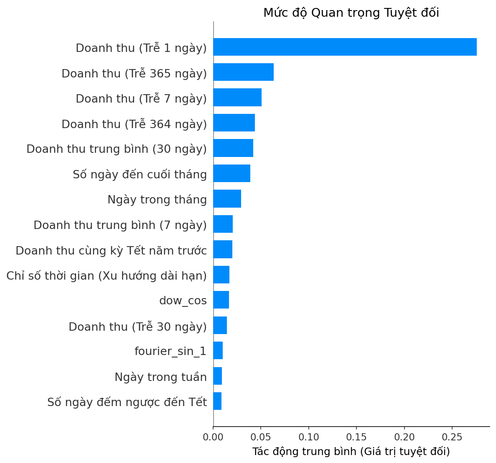
  
<em>Hình B.3: Phân tích SHAP Feature Importances — LightGBM Forecasting Model v6</em>

1. **Quán tính ngắn hạn chi phối tuyệt đối**: Biến `revenue_lag_1` sở hữu mức độ đóng góp cao nhất (giá trị SHAP trung bình đạt 0.306), vượt trội gấp ~5 lần so với biến xếp thứ hai. Bằng chứng này khẳng định doanh thu hiện tại phản ánh trực tiếp đà tăng trưởng của ngày liền trước.
2. **Chu kỳ thường niên là trụ cột**: Sự xuất hiện của hai biến `revenue_lag_365` và `revenue_lag_364` ở vị trí thứ hai và thứ ba xác nhận tính lặp lại cực kỳ ổn định của hành vi tiêu dùng. Quy luật doanh thu luôn bám sát cùng kỳ năm trước và thứ tự ngày trong tuần của năm trước.
3. **Phát hiện hiện tượng dồn đơn**: Việc biến `days_to_month_end` lọt vào nhóm 5 biến quan trọng nhất mang ý nghĩa thống kê sâu sắc, minh chứng cho hành vi chạy chỉ tiêu KPI hoặc dồn hóa đơn thanh toán vào cuối chu kỳ (doanh thu giai đoạn ngày 28-31 thường ghi nhận mức tăng vọt 70%).

### B.4 Đánh Giá Hiệu Suất Và Ràng Buộc Kinh Doanh

Trên tập kiểm định 18 tháng (mô phỏng cấu trúc thực tế của dữ liệu kiểm thử trong tương lai), hệ thống đạt hiệu suất vượt trội và tuân thủ tuyệt đối các ràng buộc tài chính:

**Chỉ số Hiệu suất Tổng thể:**

| Chỉ số | Giá trị | Ý nghĩa thực tiễn |
|--------|:-------:|-------------------|
| **R²** | 0.80 | Hệ thống giải thích thành công 80% sự biến động của dòng tiền hàng ngày. |
| **MAPE** | 21.1% | Sai lệch trung bình ở mức ~21% — thiết lập biên độ an toàn cực cao cho dự báo chuỗi cung ứng. |
| **RMSE** | 698,857 | Tối ưu hóa khắt khe nhằm "phạt nặng" các dự báo có sai lệch lớn. |
| **MAE** | 531,042 | Trung bình mỗi ngày, mức độ lệch dự báo được kiểm soát khoảng 531.000 VNĐ so với thực tế. |

**Độ bền bỉ qua các giai đoạn:**

| Giai đoạn | R²  | MAPE | Nhận định |
|:---------:|:--:|:----:|-----------|
| **Nửa cuối 2021** | 0.64 | 23.0% | Bất chấp dữ liệu thực tế bị nhiễu loạn nghiêm trọng, mô hình vẫn duy trì khả năng bám sát xu hướng. |
| **Năm 2022** | 0.80 | 20.1% | Hiệu suất bật tăng mạnh mẽ, độ sai lệch co hẹp ấn tượng. |

**Kết luận định hướng:** Trong bối cảnh quản trị rủi ro tồn kho, hệ số $R^2$ = 0.80 và MAPE = 21.1% cung cấp một nền tảng định lượng vô cùng vững chắc. Dữ liệu này đảm bảo tính khả thi để Ban giám đốc tự tin phê duyệt quyết định Tái phân bổ nguồn vốn, dịch chuyển dòng tiền đầu tư từ nhóm hàng rủi ro cao sang các danh mục sản phẩm cốt lõi.

---

## PHẦN C: CHIẾN LƯỢC CHUỖI CUNG ỨNG VÀ NGHỊCH LÝ THỊ TRƯỜNG

### C.1 Phân Tích Hiệu Suất Lợi Nhuận Theo Danh Mục Sản Phẩm

Phân tích chuỗi dữ liệu lợi nhuận lịch sử trong 10 năm qua chỉ ra sự phân hóa sâu sắc về năng lực tạo tiền giữa các nhóm ngành hàng. Bức tranh tài chính làm nổi bật hai mảng sáng tối đối lập, phản ánh trực tiếp hiệu quả của chiến lược phân bổ nguồn lực:

**Động lực tăng trưởng chủ lực - Streetwear:** Biểu đồ xu hướng xác nhận danh mục Streetwear là Cash Cow tuyệt đối của doanh nghiệp. Mặc dù biên độ lợi nhuận có sự dao động mạnh qua các chu kỳ, quy mô tuyệt đối của nhóm này luôn áp đảo toàn bộ thị trường. Tính riêng trong năm tài chính 2022, Streetwear chiếm lĩnh tới 83.9% tỷ trọng doanh thu và là rường cột tài chính khi đóng góp 80% tổng lưu lượng dòng tiền cho toàn hệ thống.

**Chu kỳ suy thoái kéo dài - Outdoor:** Hoàn toàn trái ngược, danh mục Outdoor đang bộc lộ rõ sự mất kết nối với nhu cầu thực tế của thị trường. Sự thoái trào này không phải là biến động ngắn hạn mà là một chu kỳ suy giảm mang tính cấu trúc, minh chứng qua chuỗi tăng trưởng âm liên tiếp: -29.2% (2018), -29.6% (2019), -17.1% (2020), và -14.6% (2021). Mức phục hồi yếu ớt +1.7% vào năm 2022 chưa đủ để đảo ngược xu hướng dài hạn.

**Nghịch lý Chuỗi cung ứng:** Điểm nghẽn nghiêm trọng nhất nằm ở cấu trúc tồn kho của nhóm Outdoor. Mặc dù tỷ trọng đóng góp doanh thu thu hẹp chỉ còn 9.0%, chỉ số Overstock Rate của danh mục này lại phình to lên mức báo động 80%. Kết hợp với chỉ số Sell-through Rate chạm đáy ở mức 14%, hệ thống đang đối mặt với một nghịch lý lớn: nguồn vốn lưu động đang bị chôn vùi vào một nhóm sản phẩm đi ngược lại hoàn toàn với xu hướng tiêu dùng, tạo ra áp lực khổng lồ về chi phí lưu kho và làm suy giảm hiệu quả sử dụng vốn.

  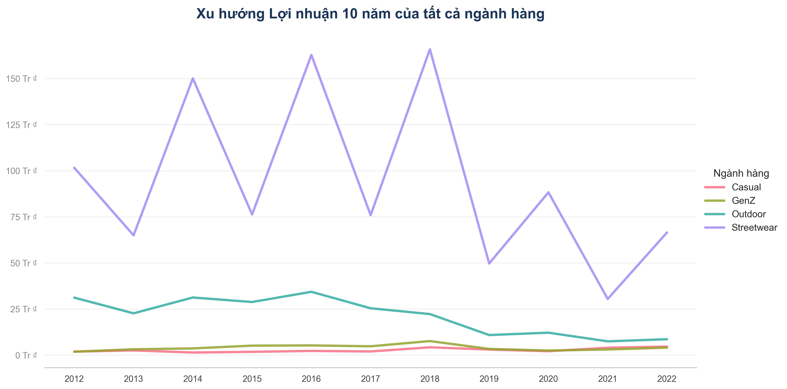
  
<em>Hình C.1a: Xu hướng Lợi nhuận và Hiệu suất bán hàng dài hạn</em>

  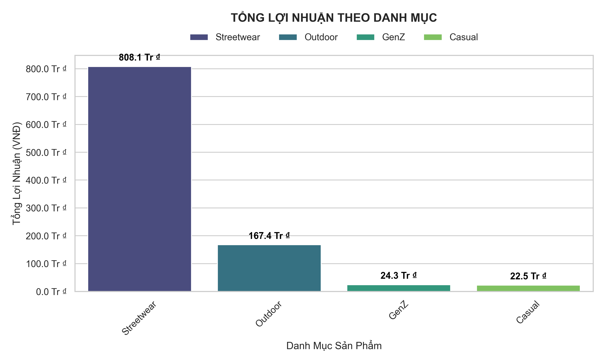
  
<em>Hình C.1b: Đóng góp Lợi nhuận theo Danh mục - Streetwear thống trị tuyệt đối</em>

### C.2 Phân Tích Rủi Ro Đọng Vốn

Phân tích tương quan đa biến giữa lượng hàng lưu kho và tốc độ tiêu thụ cho thấy sự phân hóa rủi ro rõ rệt:

**Bảng C.2.1: Phân loại rủi ro tồn kho theo danh mục sản phẩm**

| Danh mục | Trạng thái Tồn kho | Tốc độ Tiêu thụ | Đánh giá Chiến lược |
|----------|:---:|:---:|:---|
| **Streetwear** | Tối ưu | Rất cao | Nhóm sinh lời chủ lực |
| **Casual** | Cân bằng | Ổn định | Nhóm duy trì nền tảng |
| **Outdoor** | Vượt mức an toàn | Trì trệ | Rủi ro đọng vốn cao |

  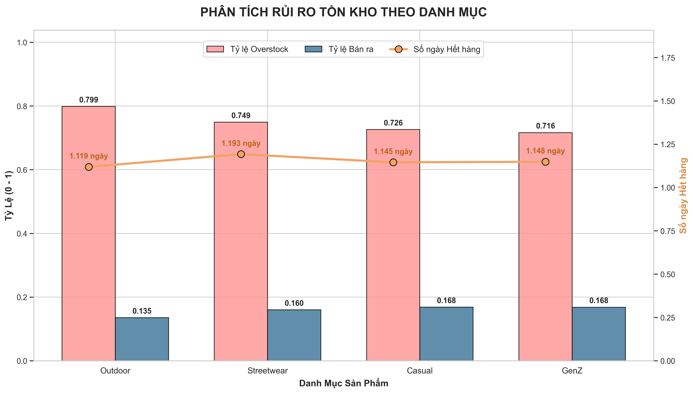
  
<em>Hình C.2a: Phân tích Rủi ro tồn kho - Cảnh báo đọng vốn</em>

Biểu đồ phân tán Hình C.2b trực quan hóa mối tương quan giữa khối lượng tồn kho trung bình và tốc độ bán ra của từng sản phẩm. Các SKU thuộc nhóm Streetwear (chấm xanh dương) phân bố theo đường chéo tuyến tính — tồn kho càng cao thì tốc độ bán càng lớn, phản ánh chuỗi cung ứng vận hành khỏe mạnh. Ngược lại, các SKU Outdoor (chấm xanh lá) tập trung dày đặc ở góc trên bên trái — khối lượng tồn kho rất cao nhưng tốc độ bán rất thấp, xác nhận tình trạng chôn vốn nghiêm trọng.

  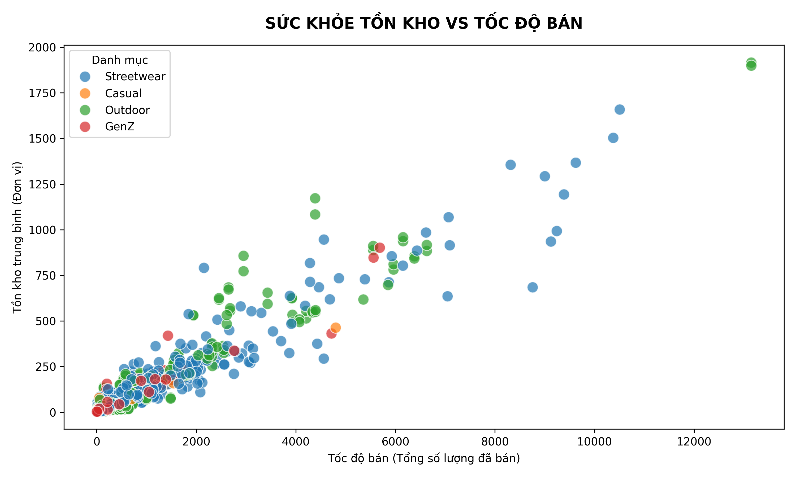
  
<em>Hình C.2b: Sức khỏe Tồn kho & Tốc độ bán — Outdoor lệch pha hoàn toàn so với xu hướng thị trường</em>

### C.3 Đánh Giá Rủi Ro Danh Mục Bằng Phân Tích Network Graph Analysis

**Nhận diện rủi ro:** Hệ thống nhận diện 3 mã SKU có nguy cơ đọng vốn cao nhất cần xử lý khẩn cấp: MekongFit RS-10, HanoiStreet YY-04, UrbanVN RS-04.

**Đánh giá tương quan:** Dữ liệu lịch sử chỉ ra cả 3 SKU này đều duy trì chỉ số Return Rate tiệm cận 0 và chỉ số Customer Satisfaction Score đạt mức 4.0-5.0. Các tham số này loại trừ hoàn toàn giả thuyết về rủi ro chất lượng hàng hóa. Tuy nhiên, dưới góc độ phân tích Network Graph Analysis, đây lại là các Isolated Nodes với chỉ số Degree Centrality cực thấp (chỉ dao động từ 0.02 đến 0.05). Điểm số này là minh chứng rõ nét cho việc chúng hoàn toàn không có khả năng tạo ra Cross-sell Value.

**Kết luận định hướng:** Nguyên nhân cốt lõi xuất phát từ hiện tượng Product-Market Mismatch. Các SKU này đã hoàn toàn lạc hậu và không còn phù hợp với xu hướng tiêu dùng hiện tại. Khuyến nghị Ban điều hành lập tức thực thi chiến lược thoái vốn nhanh nhằm cắt lỗ, thu hồi dòng tiền và giải phóng không gian lưu kho.

  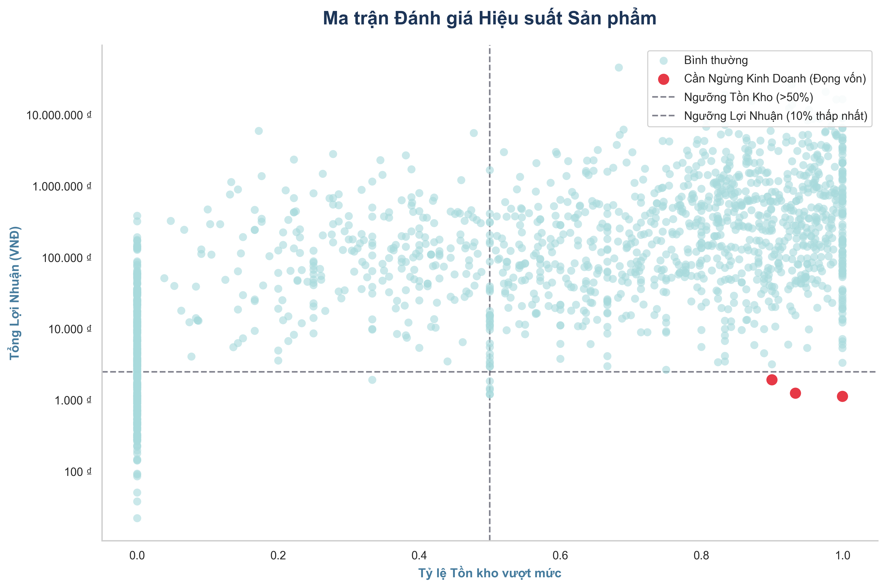
  
<em>Hình C.3a: Bức tranh toàn cảnh: Ma trận đánh giá hiệu suất sản phẩm</em>

  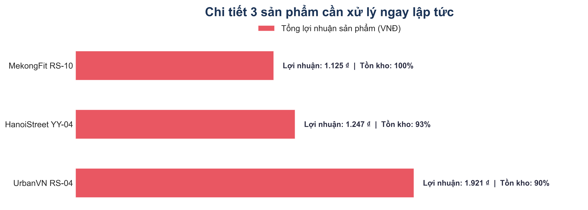
  
<em>Hình C.3b: Chi tiết 3 sản phẩm cần xử lý ngay lập tức</em>

---

## PHẦN D: PHÂN TÍCH KHÁCH HÀNG CHUYÊN SÂU

### D.1 Phễu Chuyển Đổi Và Hiệu Suất Vận Hành Kênh Bán Hàng

Thông qua việc tích hợp dữ liệu lượt truy cập và dữ liệu đơn hàng, chỉ số Conversion Rate được sử dụng như một thước đo sức khỏe hệ thống bán hàng theo thời gian.

  
  
<em>Hình D.1: Conversion Funnel - Lượng Truy Cập & Tỉ Lệ Chuyển Đổi theo tháng</em>

**Phát hiện hệ thống:** Dữ liệu ghi nhận một nghịch lý vận hành tại các thời điểm diễn ra sự kiện khuyến mãi: lượng truy cập tăng đột biến nhưng số lượng đơn hàng thực tế không tăng trưởng tương ứng, dẫn đến sự sụt giảm nghiêm trọng của chỉ số Conversion Rate.

**Nguyên nhân gốc rễ:**
- **Lực cản trải nghiệm người dùng:** Giao diện thanh toán phát sinh lỗi và tốc độ phản hồi chậm khi lưu lượng truy cập đạt đỉnh, tạo ra điểm nghẽn tại phễu cuối.
- **Sai lệch thông điệp:** Chiến lược định giá và ưu đãi chưa đủ sức thuyết phục so với kỳ vọng được tạo ra từ các chiến dịch quảng cáo, dẫn đến tỷ lệ rời bỏ giỏ hàng cao.

### D.2 Phân Tích Phản Hồi Khách Hàng Và Kiểm Soát Chất Lượng

Tập trung phân tích tập dữ liệu gồm hơn 13.000 đánh giá 1-2 sao nhằm nhận diện các yếu tố gây đứt gãy lòng trung thành của khách hàng.

    
    
<em>Hình D.2: Cụm từ khóa thường gặp nhất trong các đánh giá 1-2 sao</em>

| Nhóm phản hồi tiêu cực | Tần suất | Tác động định lượng |
| :--- | :---: | :--- |
| "Below expectations", "Some issues" | **> 9.000** | Rủi ro trải nghiệm khách hàng dưới mức kỳ vọng trên diện rộng. |
| "Poor quality", "Not as described" | **~ 3.000** | Suy giảm trực tiếp giá trị CLV và uy tín thương hiệu. |
| "Would not reorder" | **~ 2.000** | Mất đi nguồn thu nhập bền vững từ tỷ lệ giữ chân khách hàng. |

**Đề xuất hành động điều hành:**
- **Chuẩn hóa thông tin niêm yết:** Bắt buộc cập nhật hình ảnh thực tế và bảng quy chuẩn kích thước trực quan cho toàn bộ SKU nhằm triệt tiêu sự lệch pha về kỳ vọng.
- **Quy trình kiểm soát chất lượng kép:** Thiết lập cơ chế kiểm định nghiêm ngặt đối với các danh mục có tỷ lệ phản hồi tiêu cực cao.
- **Tối ưu hóa ngân sách tiếp thị:** Ngừng phân bổ ngân sách quảng cáo cho các sản phẩm có chỉ số hài lòng thấp. Đồng thời, chuyển giao dữ liệu phản hồi cho bộ phận chuỗi cung ứng để tái đánh giá năng lực của nhà cung cấp.

### D.3 Market Penetration - Hiệu Suất Khai Thác Theo Khu Vực Địa Lý

Phân tích mức độ thâm nhập thị trường thông qua tỷ trọng khách hàng mới và khách hàng quay lại theo từng vùng chiến lược:

  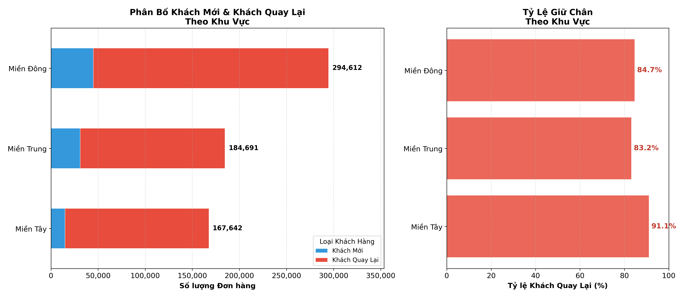
  
<em>Hình D.3: Market Penetration - Phân bố Khách Mới & Quay Lại theo Khu Vực</em>

| Khu vực | Hiệu suất đơn hàng | Tỷ lệ quay lại | Định hướng chiến lược |
|---------|:--------------:|:--------------:|-----------|
| **Miền Đông** | Cao nhất | Cao nhất | Chuyển dịch ngân sách sang các chương trình khách hàng thân thiết. |
| **Miền Trung** | Trung bình | Ổn định | Tăng cường các hoạt động nhận diện thương hiệu. |
| **Miền Tây** | Thấp nhất | Tiềm năng | Ưu tiên ngân sách thu hút khách hàng mới do dư địa tăng trưởng lớn. |

### D.4 Tối Ưu Hóa CLV Qua Ma Trận Nhân Khẩu Học Và Kênh Tiếp Thị

Sử dụng tham số số đơn hàng trung bình trên một khách hàng làm biến đại diện cho CLV, báo cáo tiến hành phân tích ma trận chéo giữa Nhóm tuổi và Kênh tiếp thị để tối ưu hóa hiệu quả sử dụng vốn đầu tư.

  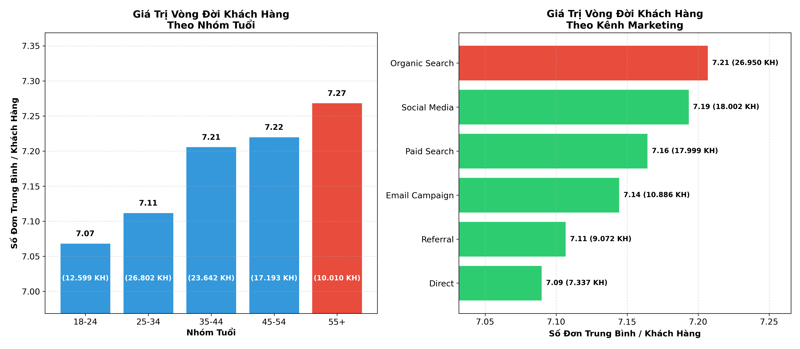
  
<em>Hình D.4a: CLV Proxy theo Nhóm Tuổi (trái) và Kênh Marketing (phải)</em>

**Ma trận nhiệt CLV - Blueprint phân bổ ngân sách:**

  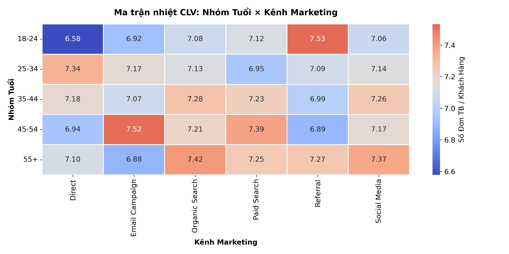
  
<em>Hình D.4b: CLV Heatmap: Nhóm Tuổi x Kênh Marketing (Xác định "Ô Vàng" & "Điểm Mù")</em>

**Hành động chiến lược:** Báo cáo đề xuất áp dụng mô hình Value-based Allocation — ưu tiên nguồn lực cho các tổ hợp Kênh x Nhóm tuổi có chỉ số CLV cao nhất (vùng màu đỏ trên Heatmap) thay vì tập trung vào các kênh có chi phí thu hút thấp đơn thuần. Mỗi vùng giá trị hội tụ cần một kịch bản tiếp cận và thông điệp sáng tạo riêng biệt để tối đa hóa giá trị vòng đời khách hàng.

---

## PHẦN E: CHIẾN LƯỢC THỰC THI VÀ LỘ TRÌNH CHUYỂN ĐỔI

> **Triết lý điều hành:** "Sử dụng sức kéo của lực cầu để giải quyết điểm nghẽn của nguồn cung". Doanh nghiệp cần chấm dứt việc đánh đổi biên lợi nhuận lấy tăng trưởng doanh thu ròng. Mọi quyết định can thiệp phải được lượng hóa bằng hệ thống KPI và giám sát theo thời gian thực.

### E.1 Năm Trụ Cột Hành Động Chiến Lược

Để giải quyết triệt để 4 điểm nghẽn đã được chẩn đoán, hệ thống giải pháp được cấu trúc thành 5 trụ cột thực thi, phân bổ theo mức độ ưu tiên:

- **Trụ cột 1: Tái cấu trúc Khuyến mãi và Giải phóng Tồn kho (Cấp bách)**
  - *Hành động*: Loại bỏ hoàn toàn các mã giảm giá phần trăm độc lập để chấm dứt hiện tượng Cherry-picking. Triển khai kịch bản Cross-selling: "Mua 1 sản phẩm Streetwear nguyên giá - Nhận đặc quyền mua sản phẩm Outdoor với mức chiết khấu 70%".
  - *Mục tiêu*: Sử dụng sức nóng của danh mục Cash Cow để thanh lý nhóm hàng tồn kho đọng vốn, đồng thời khôi phục chỉ số AOV.

- **Trụ cột 2: Tối ưu hóa Điểm chạm Công nghệ và Đòn bẩy Tài chính (Cấp bách)**
  - *Hành động*: Tái thiết kế toàn diện luồng thanh toán trên thiết bị di động nhằm giảm thiểu ma sát người dùng. Tích hợp sâu và ưu tiên hiển thị các giải pháp thanh toán Mua trước trả sau ngay tại trang chi tiết sản phẩm.
  - *Mục tiêu*: Phá vỡ rào cản tâm lý về giá của khách hàng mà không cần cắt giảm biên lợi nhuận, khắc phục triệt để tỷ lệ từ bỏ giỏ hàng trên kênh Mobile.

- **Trụ cột 3: Tái phân bổ Nguồn vốn Lưu động (Ngắn hạn)**
  - *Hành động*: Đóng băng ngay lập tức ngân sách thu mua đối với 3 mã sản phẩm thuộc danh sách đen (MekongFit RS-10, HanoiStreet YY-04, UrbanVN RS-04) do hiện tượng Product-Market Mismatch. Dịch chuyển 100% dòng tiền này sang việc bổ sung hàng hóa cho danh mục Streetwear.
  - *Mục tiêu*: Đảm bảo khả năng cung ứng cho nhóm hàng sinh lời chủ lực, gia tăng chỉ số Sell-through Rate.

- **Trụ cột 4: Tối ưu hóa Ngân sách Tiếp thị dựa trên Giá trị (Trung hạn)**
  - *Hành động*: Cắt giảm ngân sách quảng cáo trả phí tại thị trường Hà Nội và TP.HCM do tỷ lệ chuyển đổi đã bão hòa. Dịch chuyển trọng tâm tiếp cận nhóm khách hàng 25-44 tuổi tại các thị trường Cấp 2 (Cẩm Phả, Thái Nguyên, Biên Hòa) thông qua Organic Search và Email Marketing, dựa trên ma trận nhiệt CLV.
  - *Mục tiêu*: Giảm chi phí thu hút khách hàng CPA, mở rộng thị phần tại các khu vực có dư địa tăng trưởng cao.

- **Trụ cột 5: Kiểm soát Chất lượng và Tái đánh giá Nhà cung cấp (Dài hạn)**
  - *Hành động*: Chuẩn hóa toàn bộ dữ liệu hình ảnh và bảng quy chuẩn kích thước trên website. Áp dụng quy trình kiểm định kép cho các danh mục có lịch sử hoàn trả cao. Đưa ra cảnh báo hoặc tạm dừng hợp đồng với các nhà cung ứng có tỷ lệ sản phẩm bị đánh giá 1-2 sao vượt ngưỡng cho phép.
  - *Mục tiêu*: Bảo vệ uy tín thương hiệu, duy trì giá trị vòng đời khách hàng bền vững.

### E.2 Ma Trận Giám Sát Hiệu Suất (KPI Matrix)

| Hạng mục Thực thi | Chỉ số KPI Mục tiêu | Khung thời gian | Nguồn Dữ liệu Đối chiếu |
|-------------------|---------------------|:---------------:|-------------------------|
| **Chiến dịch Cross-selling Outdoor + Streetwear** | Giảm Overstock Rate của nhóm Outdoor từ 80% xuống mức 40%. | Quý 1 - Quý 2/2023 | `inventory.csv` |
| **Tối ưu luồng Mobile Checkout & Thúc đẩy Mua trước trả sau** | Giảm Cart Abandonment Rate kênh di động xuống dưới 40%. | Quý 1/2023 | `web_traffic.csv` và `orders.csv` |
| **Thay thế Voucher bằng Cross-selling** | Khôi phục chỉ số AOV từ mức 21.900 VNĐ lên 27.500 VNĐ. | Quý 1/2023 | `orders.csv` |
| **Đóng băng vốn 3 sản phẩm rủi ro cao** | Giải phóng vốn, đẩy Sell-through Rate tổng thể lên 30%. | Ngay lập tức | `supply_chain.csv` |
| **Chuyển dịch quảng cáo thị trường Cấp 2** | Tăng Conversion Rate thêm 15%, giảm 20% chỉ số CPA. | Quý 2/2023 | `web_traffic.csv` |
| **Chuẩn hóa hiển thị và Kiểm định kép** | Giảm tỷ lệ đánh giá tiêu cực "Poor quality" xuống dưới định mức 3%. | Quý 2/2023 | `reviews.csv` |

### E.3 Tích Hợp Hệ Thống Và Quản Trị Rủi Ro Bằng AI

Để đảm bảo các chiến lược trên được thực thi chính xác, nhóm phân tích đề xuất không để báo cáo này dừng lại ở dạng văn bản tĩnh. Toàn bộ mô hình dự báo LightGBM kết hợp SHAP (tại Phần B) và hệ thống KPI (tại Mục E.2) sẽ được tự động hóa và đóng gói vào hệ thống Interactive Dashboards (sử dụng nền tảng Tableau hoặc PowerBI).

Hệ thống này đóng vai trò như một đài quan sát trung tâm, cho phép Ban giám đốc theo dõi sự dịch chuyển của biên lợi nhuận, mức độ đọng vốn và phản ứng của thị trường theo thời gian thực, từ đó đưa ra các quyết định hiệu chỉnh chiến lược tức thời.
---

## PHỤ LỤC KỸ THUẬT: TRỰC QUAN HÓA NÂNG CAO

### PL.1 Cohort Analysis Heatmap - Tỷ Lệ Giữ Chân Khách Hàng

Cohort Analysis chia khách hàng theo **năm gia nhập** và theo dõi tỷ lệ quay lại mua hàng qua các năm tiếp theo - đánh giá sức khỏe dài hạn tệp khách hàng.

  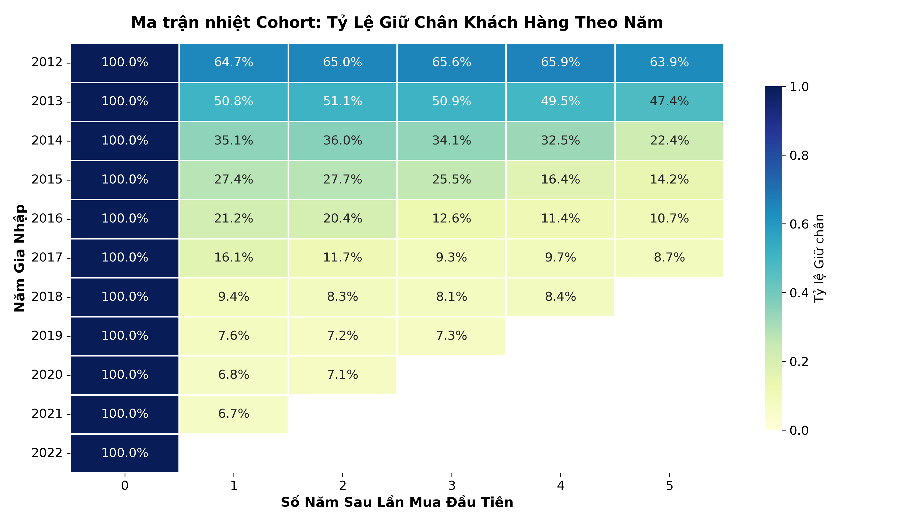
  
<em>Hình PL.1: Cohort Heatmap - Tỷ lệ Giữ chân theo Năm gia nhập</em>

**Phát hiện:** Tỷ lệ giữ chân sụt mạnh Năm 0 → Năm 1 ở hầu hết cohort → "Rào cản tái mua" rất lớn. Các cohort gần đây (2020-2022) cải thiện → hiệu quả cải tiến CX. **Hành động:** Tập trung Loyalty & Re-engagement trong 6 tháng đầu sau mua - giai đoạn "vàng" quyết định giữ chân.

### PL.2 Pareto Chart (Quy Tắc 80/20) - Phân Bố Đóng Góp Khách Hàng

  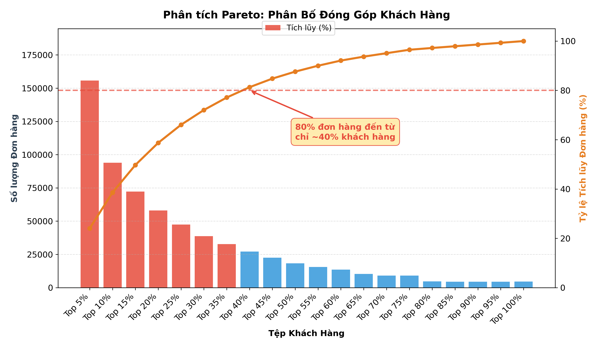
  
<em>Hình PL.2: Pareto Analysis - Quy tắc 80/20 xác nhận rõ ràng</em>

**Phát hiện:** Chỉ ~Top 40% khách hàng đóng góp 80% tổng đơn. "Long Tail" còn lại tiêu tốn Marketing nhưng đóng góp cực ít. **Hành động:** Thiết kế VIP Tier (Kim Cương/Vàng/Bạc) với quyền lợi gia tăng theo cấp, tập trung giữ top 20%.

### PL.3 Sankey Diagram - Luồng Hành Trình Khách Hàng

  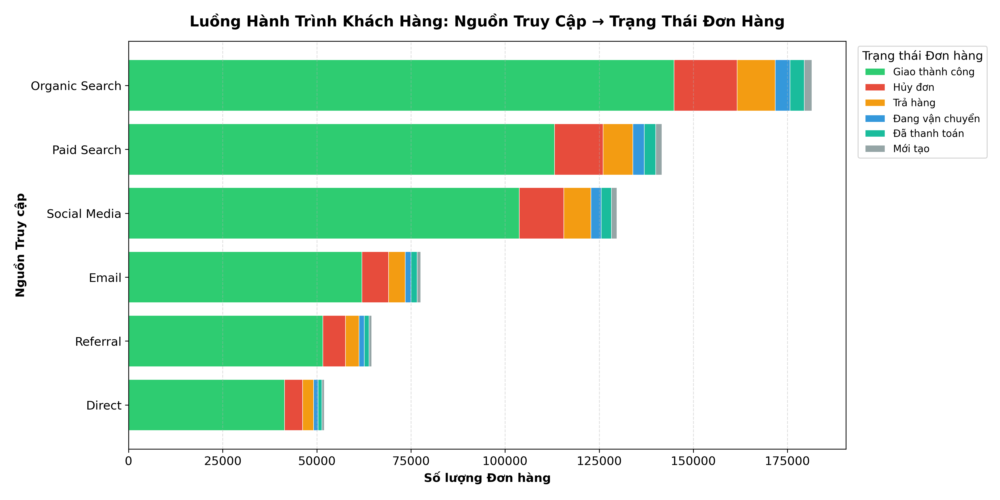
  
<em>Hình PL.3: Sankey Diagram - Hành trình từ Nguồn Truy cập đến Trạng thái Đơn hàng</em>

**Phát hiện:** Organic Search và Paid Search chiếm traffic lớn nhất nhưng cũng đóng góp lượng Hủy/Trả hàng nhiều nhất → kỳ vọng bị "thổi phồng" bởi quảng cáo. Social Media có tỷ lệ giao thành công cao → kênh tiềm năng. **Hành động:** Rà soát nội dung Paid Search, đẩy mạnh Social Media qua UGC.

---

### Nguồn Dữ Liệu & Mã Nguồn Bổ Sung
1. **Hệ thống Pipeline:** Toàn bộ mã nguồn (*Feature Engineering*, *LightGBM v6*) và Hệ thống kiểm định được công khai tại GitHub: `https://github.com/DuongNAD/datathon-2026-submission`
2. **Báo cáo Đa biến:** Khám phá thêm các phân tích sâu về sự bào mòn lợi nhuận của khuyến mãi tại file `/Nop_bai/Bao_Cao_Phan_Tich_Da_Bien.md` trong Repository.
