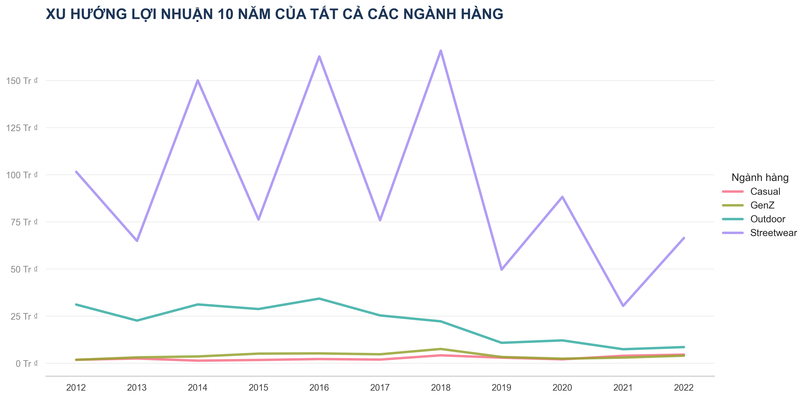
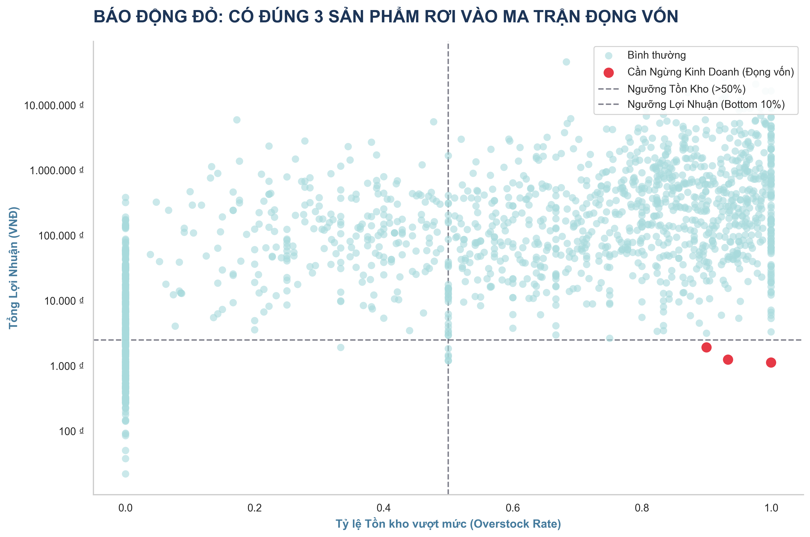
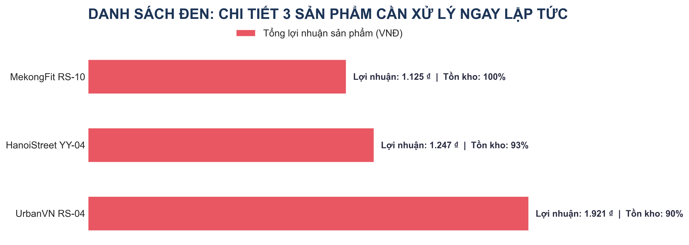

# BÁO CÁO CHIẾN LƯỢC SẢN PHẨM & CHUỖI CUNG ỨNG

## 1. PHƯƠNG PHÁP LUẬN VÀ CƠ SỞ TÍNH TOÁN
Để đưa ra các quyết định về chuỗi cung ứng, báo cáo dựa trên sự đối soát giữa Hiệu suất Tài chính và Rủi ro Vận hành thông qua các công thức cốt lõi:
- **Lợi nhuận đơn vị** = Giá bán - Giá vốn (COGS)
- **Tổng lợi nhuận** = Số lượng bán x Lợi nhuận đơn vị
- **Tỷ lệ bán ra (Sell-through Rate)** = Số lượng bán / (Số lượng bán + Tồn kho)
- **Tỷ lệ Overstock** = Tần suất hàng bị thừa so với dự báo nhu cầu.

---

## 2. THEO DÕI BIẾN ĐỘNG HÀNG HÓA CHI TIẾT THEO NĂM (TRACKING)
Dữ liệu theo dõi biến động Nhập - Bán - Tồn của các danh mục chính cho thấy sự tích tụ hàng tồn kho lớn từ sau năm 2018, đặc biệt là nhóm **Streetwear** và **Outdoor**.

*(Tham khảo bảng dữ liệu thô trong phụ lục hoặc file theo dõi tồn kho các năm).*

---

## 3. PHÂN TÍCH LỢI NHUẬN (PROFITABILITY ANALYSIS)
Căn cứ vào dữ liệu, chúng ta xác định được danh mục **Streetwear** đóng vai trò là "trụ cột" lợi nhuận. Phân khúc này cùng với Outdoor đóng góp hơn 80% tổng dòng tiền.

| Danh Mục (Category) | Tổng Lợi Nhuận (VNĐ) | Tổng Sản Lượng Bán (Units) |
| :--- | :--- | :--- |
| **Streetwear** | 808,056,608 ₫ | 511,467 |
| **Outdoor** | 167,444,316 ₫ | 337,510 |
| **GenZ** | 24,294,500 ₫ | 48,695 |
| **Casual** | 22,492,850 ₫ | 31,202 |

### Biểu đồ: Tổng Lợi Nhuận Theo Danh Mục

### Biểu đồ: Xu Hướng Lợi Nhuận 10 Năm

---

## 4. PHÂN TÍCH RỦI RO TỒN KHO (INVENTORY RISK)
Phân tích rủi ro chỉ ra rằng **Outdoor** là nhóm rủi ro nhất với Tỷ lệ tồn vượt mức (Overstock) cao nhất nhưng Tỷ lệ bán ra thấp nhất. Điều này gây ra tình trạng "giam vốn" nặng nề.

| Danh Mục | Tỷ lệ Overstock | Tỷ lệ Bán ra (Sell-through) | Số ngày Hết hàng (TB) |
| :--- | :--- | :--- | :--- |
| **Outdoor** | 0.80 | 0.14 | 1.12 |
| **Streetwear** | 0.75 | 0.16 | 1.19 |
| **Casual** | 0.73 | 0.17 | 1.15 |
| **GenZ** | 0.72 | 0.17 | 1.15 |

### Biểu đồ: Phân Tích Rủi Ro Tồn Kho

---

## 5. ĐỀ XUẤT NGỪNG KINH DOANH VÀ GIẢI PHÁP CHIẾN LƯỢC
Dựa trên "Ma trận Yếu kém" (Lợi nhuận thuộc nhóm 10% đáy và Tỷ lệ Overstock > 50%), chúng ta đề xuất loại bỏ **3 sản phẩm thảm họa** sau để lập tức thu hồi vốn lưu động:

| ID Sản Phẩm | Tên Sản Phẩm | Danh Mục | Tổng Lợi Nhuận (VNĐ) | Tỷ lệ Overstock |
| :--- | :--- | :--- | :--- | :--- |
| **1122** | MekongFit RS-10 | Outdoor | 1,125 ₫ | 100.00% |
| **1003** | HanoiStreet YY-04 | GenZ | 1,247 ₫ | 93.33% |
| **1985** | UrbanVN RS-04 | Outdoor | 1,921 ₫ | 90.00% |

### Biểu đồ: Ma Trận Đọng Vốn (Quadrant Scatter Plot)

### Biểu đồ: Danh Sách Đen Cần Xử Lý (Prescriptive Drop List)

### CÁC GIẢI PHÁP TỐI ƯU CỤ THỂ:
1. **GIẢI PHÁP XẢ KHO (LIQUIDATION):** Áp dụng chiến dịch Bundle (Bia kèm lạc). Tặng kèm các sản phẩm Outdoor tồn kho cao (>80%) cho khách hàng mua Streetwear đang hot. Mục tiêu là giải phóng không gian kho ngay lập tức.
2. **TỐI ƯU SỐ NGÀY TỒN:** Chuyển dịch từ nhập hàng khối lượng lớn sang mô hình dự báo theo tuần. Mục tiêu đưa tỷ lệ Sell-through Rate lên mức 30-40% thay vì 15% như hiện tại.
3. **ĐIỀU TIẾT DÒNG VỐN:** Ngừng nhập mới 100% đối với 3 mã sản phẩm thảm họa (HanoiStreet YY-04, MekongFit RS-10, UrbanVN RS-04) ở trên. Dồn nguồn vốn giải phóng được để nhập thêm các mã Streetwear đang có sức mua tốt.
