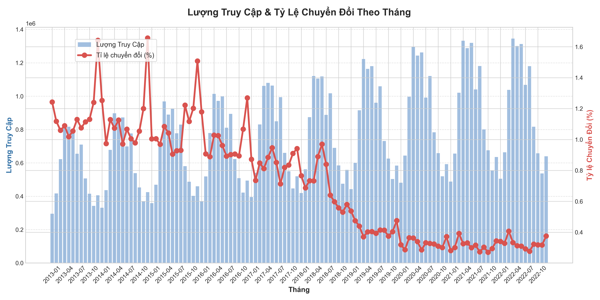
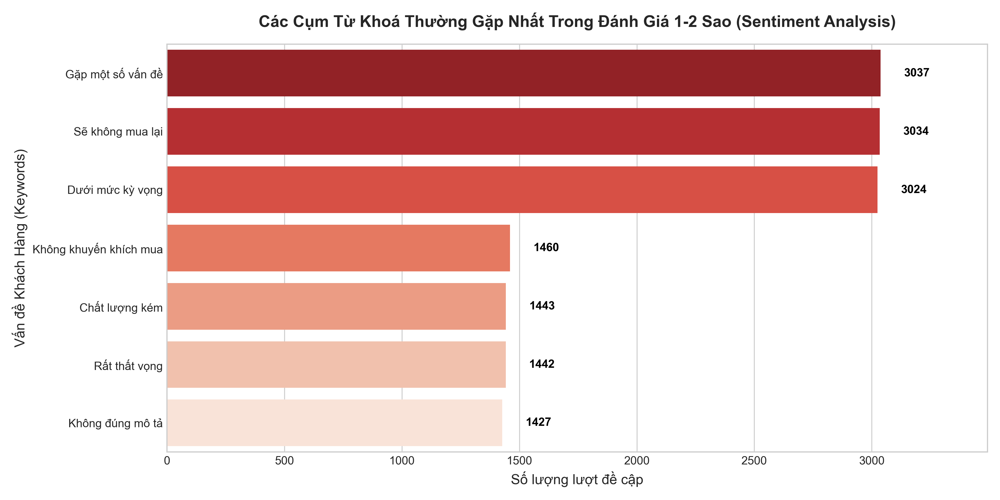

# Phụ Lục: Khai Thác Dữ Liệu Web Traffic & Reviews

Tài liệu này là một phần nghiên cứu bổ sung mang tính chiến lược, tập trung khai thác hai tệp dữ liệu thường bị bỏ quên là `web_traffic.csv` và `reviews.csv`. Mục tiêu là tối ưu hóa phễu chuyển đổi (Conversion Funnel) và phát hiện các "điểm nghẽn" trong vận hành thông qua phản hồi thực tế của khách hàng.

---

## 1. Phân Tích Phễu Chuyển Đổi (Conversion Funnel Analysis)

Phân tích phễu chuyển đổi kết hợp dữ liệu lượng truy cập (`sessions` từ `web_traffic.csv`) và số lượng đơn hàng (`orders.csv`). Việc giám sát chặt chẽ **Tỉ lệ chuyển đổi (Conversion Rate = Orders / Sessions)** theo các sự kiện lớn hoặc yếu tố mùa vụ giúp chúng ta chẩn đoán "sức khỏe" của kênh bán hàng.

### 🔍 Insights & Phân Tích
- **Nghịch lý Traffic và Chuyển Đổi:** Biểu đồ trên giúp đội ngũ quản trị nhận diện sớm tình trạng "Traffic cao nhưng Đơn hàng thấp". Trong các tháng diễn ra sự kiện hoặc mùa vụ, nếu lượng `sessions` hoặc `page_views` tăng đột biến nhưng `orders` không tăng (dẫn đến Conversion Rate cắm đầu đi xuống).
- **Nguyên nhân gốc rễ (Root Cause):** Việc mất điểm rơi ở cuối phễu mua hàng cho thấy khách hàng có quan tâm (click vào xem) nhưng quyết định không mua. Vấn đề không nằm ở chất lượng traffic, mà nằm ở:
  1. **UX/UI & Trải nghiệm Web:** Luồng thanh toán rườm rà, tốc độ tải trang chậm hoặc website bị giật lag khi lượng truy cập cao.
  2. **Chiến lược Định Giá & Khuyến Mãi (Pricing):** Mức giá/khuyến mãi chưa đủ sức thuyết phục so với kỳ vọng của khách khi họ nhấp vào quảng cáo.

### 🎯 Hành Động Đề Xuất (Actionable Recommendations)
- **Tối ưu Hành Trình Khách Hàng (Customer Journey):** Rà soát và A/B Testing liên tục luồng "Add to Cart" đến "Checkout". Cải thiện UI/UX tại các nút "Thanh toán".
- **Kiểm tra độ trễ (Latency):** Đảm bảo hạ tầng server luôn ổn định trong các đợt biến động lưu lượng lớn (ví dụ: ngày lễ, dịp Tết).

---

## 2. Phân Tích Cảm Xúc & Phản Hồi Từ Khách Hàng (Sentiment Analysis)

Thay vì chỉ nhìn vào mức đánh giá trung bình (Average Rating) rất chung chung, chúng ta cần đi sâu hơn. Bằng cách tập trung vào nhóm đánh giá **1 - 2 Sao**, tiến hành trích xuất các cụm từ khóa (Keywords) xuất hiện nhiều nhất để đưa ra những chỉ dẫn vận hành chính xác nhất.

### 🔍 Insights & Phân Tích
Dựa trên kết quả phân tích dữ liệu hơn 13,000 lượt đánh giá tiêu cực, các vấn đề cốt lõi lớn nhất lộ diện:
1. **Trải Nghiệm Dưới Kỳ Vọng ("Below expectations", "Some issues", "Would not reorder"):** Lên đến hơn 9,000 lượt đề cập. Điều này cho thấy sự chênh lệch lớn giữa Lời Hứa Thương Hiệu (Marketing) và Trải Nghiệm Thực Tế (Sản phẩm).
2. **Khủng Hoảng Niềm Tin Sản Phẩm ("Poor quality", "Not as described"):** Gần 3,000 lượt đề cập cho thấy sự bất bình mạnh mẽ về chất lượng (hàng lỗi, chất liệu không như ảnh quảng cáo). Đây là nguyên nhân trực tiếp kéo tụt CLV (Giá trị vòng đời khách hàng).

### 🎯 Hành Động Đề Xuất (Actionable Recommendations)
- **Chuẩn hóa Thông Tin Sản Phẩm:** Xử lý triệt để nhóm lỗi "Not as described" bằng cách cập nhật hình ảnh, video thực tế và mô tả chính xác về kích thước (size chart), chất liệu sản phẩm.
- **Quy Trình Kiểm Soát Chất Lượng (QC) Kép:** Đưa nhóm từ khóa "Poor quality" vào cảnh báo đỏ. Bất kỳ mã sản phẩm nào (SKU) có tỷ lệ đánh giá "Poor quality" vượt ngưỡng 5% cần tự động bị gỡ khỏi chiến dịch Marketing và gửi trả về bộ phận Chuỗi Cung Ứng (Supply Chain) để đánh giá lại nhà cung cấp.
- **Tối Ưu Vận Hành (Operations):** Sử dụng các insight này làm KPI cho bộ phận Chăm Sóc Khách Hàng (CSKH), chủ động gọi điện xin lỗi và đền bù cho các nhóm review 1 sao có từ khóa nhạy cảm nhằm cứu vãn Tỷ lệ giữ chân (Retention Rate).
